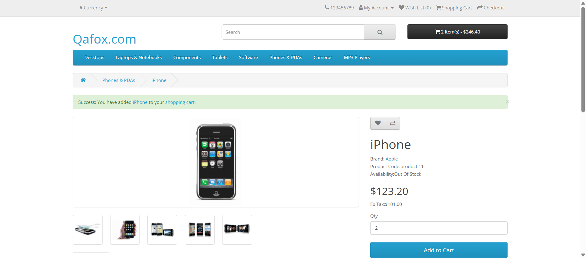
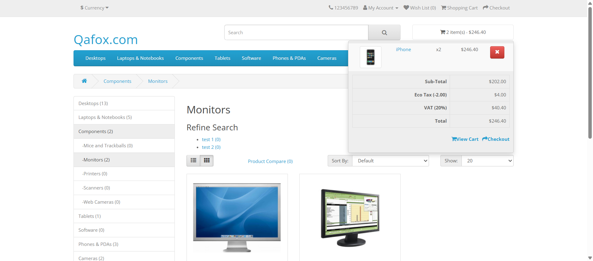

## Screenshots

**1. Home Page**


**2. Cart Page**


**3. Order Success Page**


1️⃣ # Folder Structure:

# E-commerce_automation/

 ├── Pages/

 │ ├── HomePage.py

 │ ├── PhonePDAPage.py

 │ ├── iPhonePage.py

 │ ├── LaptopPage.py

 │ ├── HPpage.py

 │ ├── CheckoutPage.py

 │ └── SuccessPage.py

 ├── Reports/ # Generated automatically by HtmlTestRunner

 ├── Screenshots/ # Captured automatically on failures

 ├── drivers/ # ChromeDriver.exe or optional (webdriver-manager can auto-download)

 ├── ecomproject.py # Main test script

 └── README.md # Complete project description

2️⃣ README.md (Professional, GitHub Ready)

# E-commerce Website Automation Using Selenium (Python)

# E-commerce Website Automation Using Selenium (Python)

## Project Overview

This project automates **end-to-end shopping workflows** on a dummy e-commerce website using **Python**, **Selenium**, and **Page Object Model (POM)** design pattern.  
It validates **product selection, cart operations, guest checkout, billing, delivery, payment, and order confirmation**.

**Website:** [http://tutorialsninja.com/demo/](http://tutorialsninja.com/demo/)  
**Framework:** Page Object Model (POM)  
**Reports:** HTMLTestRunner

---

## Features Automated

- Open the e-commerce website.
- Select a product (iPhone) with quantity >1 and add to cart.
- Select another product (HP Laptop), update delivery date, and add to cart.
- View cart and proceed as **guest checkout**.
- Fill all **billing and delivery details**.
- Complete **delivery & payment methods**.
- Confirm order and validate **order success message**.

---

## Project Structure

ecommerce_automation/
├── Pages/ # All POM classes
├── Reports/ # HTML reports
├── Screenshots/ # Screenshots for failures
├── drivers/ # ChromeDriver executable
├── ecomproject.py # Test script
└── README.md

---

## Setup & Installation

1. Clone repository:

````bash
   git clone <your-repo-link >


2. Install dependencies :

pip install selenium
pip install html-testRunner
pip install webdriver-manager


3. Place ChromeDriver in drivers/ folder (or use webdriver-manager).

4. How to Run

python ecomproject.py


Reports will be generated automatically in Reports/.

Screenshots on failures will be saved in Screenshots/.

Notes

Uses explicit waits for stable automation.

Implements Page Object Model (POM) for maintainability.

Screenshots help debug failed tests.

All critical actions like guest checkout, payment, and order confirmation are automated.


---

### **3️⃣ Resume-Ready Project Description**

**E-commerce Website Automation (Python & Selenium)**

- Developed a **scalable automation framework** using **Page Object Model (POM)** for a dummy e-commerce site.
- Automated **end-to-end shopping workflow** including **product selection, add to cart, guest checkout, billing, delivery, payment, and order confirmation**.
- Implemented **explicit waits**, **screenshot capture**, and **HTMLTestRunner reports** for reliable test execution and debugging.
- Structured project with dedicated folders: **Pages**, **Reports**, **Screenshots**, and **Drivers** to ensure maintainability and scalability.
- Built reusable methods and utilities for WebDriver setup, logging, and form interactions.


1.Pages/ → All Page Object Model (POM) classes:

     HomePage.py

     PhonePDAPage.py

     iPhonePage.py

     LaptopPage.py

     HPpage.py

     CheckoutPage.py

     SuccessPage.py

2.Reports/ → HTML reports generated after running tests.

3.Screenshots/ → Automatic screenshots on test failures.

4.drivers/ → ChromeDriver (or use webdriver-manager).

5.ecom__project.py → Complete test script using unittest + HtmlTestRunner.

6.README.md → Professional README ready for GitHub, explaining project setup, execution, and folder structure.

---

# Ecommerce Selenium Automation Project

# --------------------------
# Folder Structure
# --------------------------
# ecommerce_automation/
# ├── Pages/
# │   ├── HomePage.py
# │   ├── PhonePDAPage.py
# │   ├── iPhonePage.py
# │   ├── LaptopPage.py
# │   ├── HPpage.py
# │   ├── CheckoutPage.py
# │   └── SuccessPage.py
# ├── Reports/          # HTMLTestRunner reports generated automatically
# ├── Screenshots/      # Screenshots captured automatically on test failures
# ├── drivers/          # ChromeDriver executable (optional if using webdriver-manager)
# ├── ecomproject.py    # Main test script using unittest + HtmlTestRunner
# └── README.md         # Complete project description, setup, and execution guide

# --------------------------
# README.md Content
# --------------------------
# # E-commerce Website Automation Using Selenium (Python)
#
# ## Project Overview
# This project automates end-to-end shopping workflows on a dummy e-commerce website using Python and Selenium WebDriver.
# It uses Page Object Model (POM) design pattern for better maintainability and scalability.
#
# **Website:** [http://tutorialsninja.com/demo/](http://tutorialsninja.com/demo/)
# **Framework:** Page Object Model (POM)
# **Reports:** HTMLTestRunner
#
# ## Features Automated
# - Open the e-commerce website.
# - Select a product (iPhone) with quantity >1 and add to cart.
# - Select another product (HP Laptop), update delivery date, and add to cart.
# - View cart and proceed as guest checkout.
# - Fill all billing and delivery details.
# - Complete delivery & payment methods.
# - Confirm order and validate order success message.
#
# ## Setup & Installation
# 1. Clone the repository:
# ```bash
# git clone <your-repo-link>
# ```
# 2. Install dependencies:
# ```bash
# pip install selenium
# pip install html-testRunner
# pip install webdriver-manager
# ```
# 3. Place ChromeDriver in `drivers/` folder or use webdriver-manager to auto-download.
#
# ## How to Run
# ```bash
# python ecomproject.py
# ```
# - Reports will be generated automatically in `Reports/`.
# - Screenshots on failures will be saved in `Screenshots/`.
#
# ## Notes
# - Uses explicit waits for reliable automation.
# - Implements Page Object Model (POM) for maintainable and scalable test scripts.
# - Screenshots help debug failed tests.
# - All critical actions like guest checkout, payment, and order confirmation are automated.

# --------------------------
# Resume-Ready Description
# --------------------------
# **E-commerce Website Automation (Python & Selenium)**
# - Developed a scalable automation framework using Page Object Model (POM) for a dummy e-commerce site.
# - Automated end-to-end shopping workflow including product selection, add to cart, guest checkout, billing, delivery, payment, and order confirmation.
# - Implemented explicit waits, screenshot capture, and HTMLTestRunner reports for reliable test execution and debugging.
# - Structured project with dedicated folders: Pages, Reports, Screenshots, and Drivers for maintainability.
# - Built reusable methods and utilities for WebDriver setup, logging, and form interactions.
````

=======

# E-commerce-selenium-automation

Python, Selenium, Automation, Testing, QA, SDET, Page Object Model, HTMLTestRunner, Web Automation 167fce9f178f957d451b8455ba1c67d119e4d1c7
